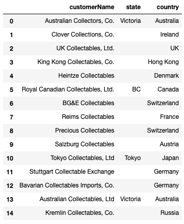
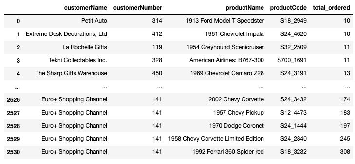

Using a customer database provided to me, this lab practices using SQL to pull several reports on different segments of the database and analyze trends based on those queries.

<!--more--> 

## The Task
Your employer makes miniature models of products such as classic cars, motorcycles, and planes. They want you to pull several reports on different segments of their past customers, in order to better understand past sales as well as determine which customers will receive promotional material.

Here is the entity relationship diagram (ERD) of the customer database from which we'll be working.


### Getting Started
We can conduct SQL queries using `pandas` with the `sqlite3` library.


```{python, eval=FALSE}

import sqlite3
import pandas

# conn establishes a connection between pandas and the sql database
conn = sqlite3.Connection("data.sqlite")

```


#### Query: Customers with Credit Over 25,000 in California
Write a query that gets the contact first name, contact last name, phone number, address line 1, and credit limit for all customers in California with a credit limit greater than 25000.00.

```{python, eval=FALSE}

q1 = """
SELECT
    contactFirstName,
    contactLastName,
    phone,
    addressLine1,
    creditLimit
FROM
    customers
WHERE
    state = 'CA'
    AND creditLimit > 25000.00
    
;
"""
q1_result = pd.read_sql(q1, conn)
q1_result

```

Output


#### Query: Customers Outside of the USA with "Collect" in Their Name

Write a query that gets the customer name, state, and country, for all customers outside of the USA with `"Collect"` as part of their customer name.


```{python, eval=FALSE}

q2 = """
SELECT
    customerName,
    state,
    country
FROM
    customers
WHERE
    country != 'USA'
    AND customerName LIKE '%Collect%'
;
"""
q2_result = pd.read_sql(q2, conn)
q2_result

```

Output


#### Query : Average Credit Limit by State in USA

Write a query that gets the average credit limit per state in the USA.

The two fields selected should be `state` and `average_credit_limit`, which is the average of the `creditLimit` field for that state.


```{python, eval=FALSE}

q3 = """
SELECT
    state, AVG(creditLimit) AS average_credit_limit
FROM
    customers
WHERE
    country = 'USA'
GROUP BY
    state
;
"""

q3_result = pd.read_sql(q3, conn)
q3_result

```

Output


#### Query: Joining Customers and Orders

Write a query that uses `JOIN` statements to get the customer name, order number, and status for all orders. Refer to the ERD above to understand which tables contain these pieces of information, and the relationship between these tables.

We will only display the first 15 results.

```{python, eval=FALSE}

q4 = """
SELECT
    customerName,
    orderNumber,
    status
FROM
    customers
JOIN orders
    ON customers.customerNumber = orders.customerNumber
;
"""

q4_result = pd.read_sql(q4, conn)
q4_result.head(15)

```

Output


#### Query: Products that Have Been Purchased 10 or More Times

Write a query that, for each customer, finds all of the products that they have purchased 10 or more times cumulatively. For each record, return  the customer name, customer number, product name, product code, and total number ordered. Sort the rows in descending order by the quantity ordered.

The five columns selected should be `customerName`, `customerNumber`, `productName`, `productCode`, and `total_ordered`, where `total_ordered` is the sum of all quantities of that product ordered by that customer.


```{python, eval=FALSE}

q5 = """
SELECT
    c.customerName,
    c.customerNumber,
    p.productName,
    p.productCode,
    SUM(od.quantityOrdered) AS total_ordered
FROM
    customers c
    JOIN orders o
        ON c.customerNumber = o.customerNumber
    JOIN orderdetails od
        ON od.orderNumber = o.orderNumber
    JOIN products p
        ON p.productCode = od.productCode
GROUP BY
    c.customerName, od.productCode
HAVING SUM(od.quantityOrdered) >= 10
ORDER BY
    total_ordered, c.customerNumber

;
"""

q5_result = pd.read_sql(q5, conn)
q5_result

```

Output


### Summary

In this code through, I provided examples of several data queries for a model car company, mainly focused around its customer data using many of the major concepts and keywords associated with SQL `SELECT` queries: `FROM`, `WHERE`, `GROUP BY`, `HAVING`, `ORDER BY`, `JOIN`, `SUM`, `COUNT`, and `AVG`.
