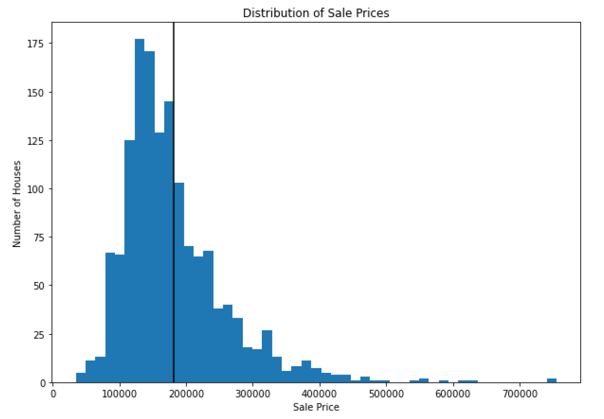

Using the [Ames, IA Housing dataset](https://www.kaggle.com/c/house-prices-advanced-regression-techniques), this lab demonstrates my utilization of `pandas` to calculate central tendency, create subsets of data, use data visualizations to explore data, and gain insight into the dataset.

<!--more--> 

## Explore Data Distributions

Produce summary statistics, visualizations, and interpretive text describing the distributions of `SalePrice`, `TotRmsAbvGrd`, and `OverallCond`.

**Sale Price**
```{python, eval=FALSE}

# Create an object that is a list of the sale prices
sp = df['SalePrice']

# Create an object that is the mean of the list of sale prices
sp.mean = df['SalePrice'].mean()

# Plot distribution of sale price
fig, ax = plt.subplots(figsize=(10,7))
ax.hist(sp, bins = "auto", alpha = 0.7)
ax.axvline(sp.mean, color = "black")
ax.set_xlabel('Sale Price');
ax.set_ylabel('Number of Houses')
ax.set_title('Distribution of Sale Prices');

```



```{python, eval=FALSE}

print("The mean is:", sp.mean)
print("The median is:", df['SalePrice'].median())
print("The standard deviation is:", df['SalePrice'].std())

```

The mean is: 180921.20
The median is: 163000.0
The standard deviation is: 79442.50

The distribution of the sale prices is left-skewed with its mean sale price of $180,900 and median sale price of $163,000. There seem to be some significant outliers that are influencing the mean, so the median is helpful to know.

## Explore Differences between Subsets

Separate the data into subsets based on `OverallCond`, create three variables, then demonstrate how this split impacts the distribution of `SalePrice`.

* `below_average_condition`: home sales where the overall condition was less than 5
* `average_condition`: home sales where the overall condition was exactly 5
* `above_average_condition`: home sales where the overall condition was greater than 5

```{python, eval=FALSE}

below_average_condition = df[df['OverallCond'] < 5]
average_condition = df[df['OverallCond'] == 5]
above_average_condition = df[df['OverallCond'] > 5]

```


Plot of the distributions of sale price for each of these subsets.

```{python, eval=FALSE}

# Set up plot
fig, ax = plt.subplots(figsize=(15,5))

# Create custom bins so all are on the same scale
bins = range(df["SalePrice"].min(), df["SalePrice"].max(), int(df["SalePrice"].median()) // 20)

# Plot three histograms, with reduced opacity (alpha) so we
# can see them overlapping
ax.hist(
    x=above_average_condition["SalePrice"],
    label="above average condition",
    bins=bins,
    color="cyan",
    alpha=0.5
)
ax.hist(
    x=average_condition["SalePrice"],
    label="average condition",
    bins=bins,
    color="gray",
    alpha=0.3
)
ax.hist(
    x=below_average_condition["SalePrice"],
    label="below average condition",
    bins=bins,
    color="yellow",
    alpha=0.5
)

# Customize labels
ax.set_title("Distributions of Sale Price Grouped by Condition")
ax.set_xlabel("Sale Price")
ax.set_ylabel("Number of Houses")
ax.legend();

```


It's pretty clear that fewer homes were sold if their condition were below average. What's more interesting to me is that the range of homes sold, both in number and price, seems greater for "average condition" than that of "above average." I suppose that maybe makes sense in terms of availability, but this visualization would give me pause if someone said that above average conditioned home sell more often and for more money than average homes.


## Explore Correlations

Find the features that have the strongest positive and negative correlations with `SalePrice`, and produce plots representing these relationships.

```{python, eval=FALSE}

correlation_series = df.corr()['SalePrice'].sort_values()

max_corr_value = correlation_series.iloc[-2]
max_corr_column = correlation_series.index[-2]
print("Most Positively Correlated Column:", max_corr_column)
print("Maximum Correlation Value:", max_corr_value)

```

Most Positively Correlated Column: OverallQual
Maximum Correlation Value: 0.79

```{python, eval=FALSE}

correlation_series = df.corr()['SalePrice'].sort_values()

min_corr_value = correlation_series.iloc[0]
min_corr_column = correlation_series.index[0]
print("Most Negatively Correlated Column:", min_corr_column)
print("Minimum Correlation Value:", min_corr_value)

```

Most Negatively Correlated Column: KitchenAbvGr
Minimum Correlation Value: -0.14

Create a box plot of the relevant columns.

```{python, eval=FALSE}

import seaborn as sns

fig, (ax1, ax2) = plt.subplots(ncols=2, figsize=(15,5))

# Plot distribution of column with highest correlation
sns.boxplot(
    x=df[max_corr_column],
    y=df["SalePrice"],
    ax=ax1
)
# Plot distribution of column with most negative correlation
sns.boxplot(
    x=df[min_corr_column],
    y=df["SalePrice"],
    ax=ax2
)

# Customize labels
ax1.set_title("Boxplot of Overall Condition with Sale Price")
ax1.set_xlabel("Overall Condition")
ax1.set_ylabel("Sale Price")
ax2.set_title("Boxplot of the Number of Kitchens Above Ground with Sale Price")
ax2.set_xlabel("Number of Kitchens Above Ground")
ax2.set_ylabel("Sale Price");

```


With regards to the boxplot of the overall condition of the home sold, there is a clear positive correlation, that as the overall condition improves from "Average" to "Good" to "Excellent", so too does the sale price - logic saying that the nicer the condition, the nicer the home, the more expensive the home. We also see more variance in sale price with as the overall condition improves, so there must be more in the data to explain that.

For the number of kitchens above ground, this seems like a silly correlation to highlight; while mathematically it may indicate the strongest negative correlation, what are additional factors that may be driving this other than just tbe number of kitchens above ground.

## Engineer and Explore a New Feature

What is the relationship between the year sold and the year built?

Create a new feature `Age`, which represents the difference between the year sold and the year built, and plot the relationship between the age and sale price.

```{python, eval=FALSE}

# Make a new column, Age
df["Age"] = df["YrSold"] - df["YearBuilt"]

# Set up plot
fig, ax = plt.subplots(figsize=(15,5))

# Plot Age vs. SalePrice
ax.scatter(df["Age"], df["SalePrice"], alpha=0.3, color="green")
ax.set_title("Home Age vs. Sale Price")
ax.set_xlabel("Age of Home at Time of Sale")
ax.set_ylabel("Sale Price");

```


Generally speaking, the newer the home, the more expensive the sale price. This could be associated with the overall condition of the home, so that would be an interesting factor to include in analysis.


Attribution: [The Flatiron School repo](https://github.com/learn-co-curriculum/dsc-pandas-eda-lab)


