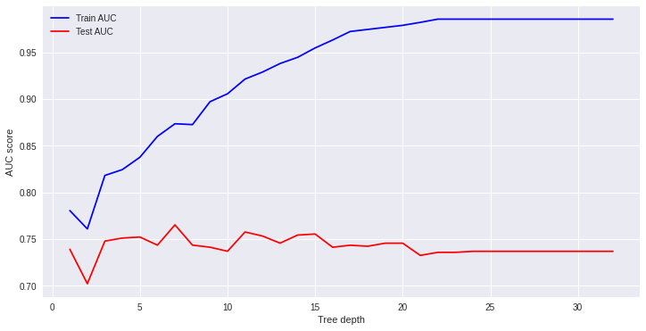
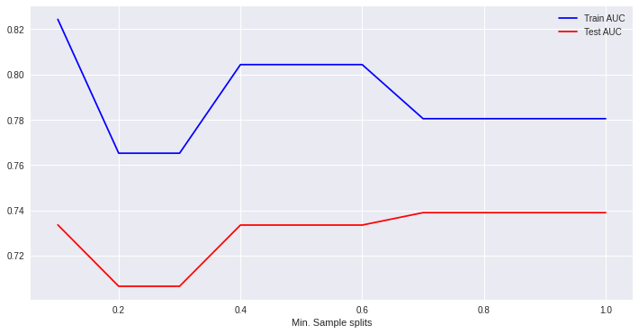
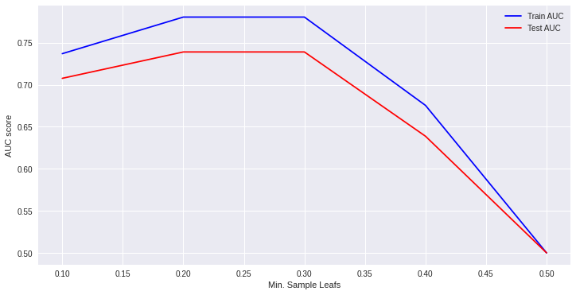
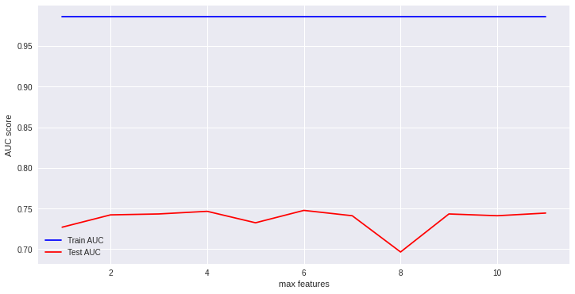

# Hyperparameter Tuning and Pruning in Decision Trees

## Introduction

In this lab, I demonstrate the impact of tree pruning and hyperparameter tuning on the predictive performance of a decision tree classifier. Pruning reduces the size of decision trees by removing nodes of the tree that do not provide much predictive power to classify instances. Decision trees are the most susceptible out of all the machine learning algorithms to overfitting and effective pruning can reduce this likelihood. 

## Create training and test sets

- Assign the `'Survived'` column to `y` 
- Drop the `'Survived'` and `'PassengerId'` columns from `df`, and assign the resulting DataFrame to `X` 
- Split `X` and `y` into training and test sets. Assign 30% to the test set and set the `random_state` to `SEED` 


```{python, eval=FALSE}
# Create X and y 
y = df['Survived']
X = df.drop(columns = ['Survived', 'PassengerId'], axis = 1)

# Split into training and test sets
SEED = 1
X_train, X_test, y_train, y_test = train_test_split(X, y, test_size=0.3, random_state=SEED)
```

## Train a vanilla classifier

__Note:__ The term "vanilla" is used for a machine learning algorithm with its default settings (no tweaking/tuning).


```{python, eval=FALSE}
# Train the classifier using training data
dt = DecisionTreeClassifier(criterion = 'entropy', random_state = SEED)

dt.fit(X_train, y_train)
```

## Make predictions 
- Create a set of predictions using the test set 
- Using `y_test` and `y_pred`, calculate the AUC (Area under the curve) to check the predictive performance

```{python, eval=FALSE}
# Make predictions using test set 
y_pred = dt.predict(X_test)

# Check the AUC of predictions
false_positive_rate, true_positive_rate, thresholds = roc_curve(y_test, y_pred)
roc_auc = auc(false_positive_rate, true_positive_rate)
roc_auc
```

    0.9956521739130435

## Maximum Tree Depth

Let's check for the best depth parameter for the decision tree: 

- Create an array for `max_depth` values ranging from 1 - 32  
- In a loop, train the classifier for each depth value (32 runs) 
- Calculate the training and test AUC for each run 
- Plot a graph to show under/overfitting and the optimal value 
- Interpret the results 

```{python, eval=FALSE}
# Identify the optimal tree depth for given data

# Create an array for max_depth values ranging 1-32
max_depths = np.linspace(1, 32, 32, endpoint=True)

# Create a loop, training the classifier for each depth value (32 runs)
train_results = []
test_results = []
for max_depth in max_depths:
   dt = DecisionTreeClassifier(criterion='entropy', max_depth=max_depth, random_state=SEED)
   dt.fit(X_train, y_train)
   train_pred = dt.predict(X_train)
   false_positive_rate, true_positive_rate, thresholds = roc_curve(y_train, train_pred)
   roc_auc = auc(false_positive_rate, true_positive_rate)
   # Add auc score to previous train results
   train_results.append(roc_auc)
   y_pred = dt.predict(X_test)
   false_positive_rate, true_positive_rate, thresholds = roc_curve(y_test, y_pred)
   roc_auc = auc(false_positive_rate, true_positive_rate)
   # Add auc score to previous test results
   test_results.append(roc_auc)

plt.figure(figsize=(12,6))
plt.plot(max_depths, train_results, 'b', label='Train AUC')
plt.plot(max_depths, test_results, 'r', label='Test AUC')
plt.ylabel('AUC score')
plt.xlabel('Tree depth')
plt.legend()
plt.show()
```




***

* Here the training error decreases with increasing tree depth, which is a clear sign of overfitting.
*Test error increases after depth = 3 - nothing more to learn from deeper trees (some fluctuations, but not stable)
* Training and test errors rise rapidly between the depths of 2 and 3
* Optimal value seen here is 3

## Minimum Sample Split

Now check for the best `min_samples_splits` parameter for the decision tree 

- Create an array for `min_sample_splits` values ranging from 0.1 - 1 with an increment of 0.1 
- In a loop, train the classifier for each `min_samples_splits` value (10 runs) 
- Calculate the training and test AUC for each run 
- Plot a graph to show under/overfitting and the optimal value 
- Interpret the results


```{python, eval=FALSE}
# Identify the optimal min-samples-split for given data

# Create an array for min_sample_splits values ranging from 0.1 - 1 with an increment of 0.1
min_samples_splits = np.linspace(0.1, 1.0, 10, endpoint=True)

# Create a loop, training the classifier for each min_samples_splits value (10 runs)
train_results = []
test_results = []
for min_samples_split in min_samples_splits:
   dt = DecisionTreeClassifier(criterion='entropy', min_samples_split=min_samples_split, random_state=SEED)
   dt.fit(X_train, y_train)
   train_pred = dt.predict(X_train)
   false_positive_rate, true_positive_rate, thresholds =    roc_curve(y_train, train_pred)
   roc_auc = auc(false_positive_rate, true_positive_rate)
   train_results.append(roc_auc)
   y_pred = dt.predict(X_test)
   false_positive_rate, true_positive_rate, thresholds = roc_curve(y_test, y_pred)
   roc_auc = auc(false_positive_rate, true_positive_rate)
   test_results.append(roc_auc)

plt.figure(figsize=(12,6))
plt.plot(min_samples_splits, train_results, 'b', label='Train AUC')
plt.plot(min_samples_splits, test_results, 'r', label='Test AUC')
plt.xlabel('Min. Sample splits')
plt.legend()
plt.show()
```





* AUC for both test and train data stabilizes at 0.7 
* Further increase in minimum sample split does not improve learning 


## Minimum Sample Leafs

Now check for the best `min_samples_leafs` parameter value for the decision tree 

- Create an array for `min_samples_leafs` values ranging from 0.1 - 0.5 with an increment of 0.1 
- In a loop, train the classifier for each `min_samples_leafs` value (5 runs) 
- Calculate the training and test AUC for each run 
- Plot a graph to show under/overfitting and the optimal value 
- Interpret the results


```{python, eval=FALSE}
# Calculate the optimal value for minimum sample leafs

# Create an array for min_samples_leafs values ranging from 0.1 - 0.5 with an increment of 0.1
min_samples_leafs = np.linspace(0.1, 0.5, 5, endpoint=True)

# Create a loop, training the classifier for each min_samples_leaf value (5 runs)
train_results = []
test_results = []
for min_samples_leaf in min_samples_leafs:
   dt = DecisionTreeClassifier(criterion='entropy', min_samples_leaf=min_samples_leaf, random_state=SEED)
   dt.fit(X_train, y_train)
   train_pred = dt.predict(X_train)
   false_positive_rate, true_positive_rate, thresholds = roc_curve(y_train, train_pred)
   roc_auc = auc(false_positive_rate, true_positive_rate)
   train_results.append(roc_auc)
   y_pred = dt.predict(X_test)
   false_positive_rate, true_positive_rate, thresholds = roc_curve(y_test, y_pred)
   roc_auc = auc(false_positive_rate, true_positive_rate)
   test_results.append(roc_auc)
    
plt.figure(figsize=(12,6))    
plt.plot(min_samples_leafs, train_results, 'b', label='Train AUC')
plt.plot(min_samples_leafs, test_results, 'r', label='Test AUC')
plt.ylabel('AUC score')
plt.xlabel('Min. Sample Leafs')
plt.legend()
plt.show()
```




* AUC gives best value between 0.2 and 0.3 for both test and training sets 
* The accuracy drops down if we continue to increase the parameter value 


## Maximum Features

Now check for the best `max_features` parameter value for the decision tree 

- Create an array for `max_features` values ranging from 1 - 12 (1 feature vs all)
- In a loop, train the classifier for each `max_features` value (12 runs) 
- Calculate the training and test AUC for each run 
- Plot a graph to show under/overfitting and the optimal value 
- Interpret the results


```{python, eval=FALSE}
# Find the best value for optimal maximum feature size

# Create an array for max_features values ranging from 1 - 12 (1 feature vs all)
max_features = list(range(1, X_train.shape[1]))

# Create a loop, training the classifier for each max_features value (12 runs)
train_results = []
test_results = []
for max_feature in max_features:
   dt = DecisionTreeClassifier(criterion='entropy', max_features=max_feature, random_state=SEED)
   dt.fit(X_train, y_train)
   train_pred = dt.predict(X_train)
   false_positive_rate, true_positive_rate, thresholds = roc_curve(y_train, train_pred)
   roc_auc = auc(false_positive_rate, true_positive_rate)
   train_results.append(roc_auc)
   y_pred = dt.predict(X_test)
   false_positive_rate, true_positive_rate, thresholds = roc_curve(y_test, y_pred)
   roc_auc = auc(false_positive_rate, true_positive_rate)
   test_results.append(roc_auc)

plt.figure(figsize=(12,6))
plt.plot(max_features, train_results, 'b', label='Train AUC')
plt.plot(max_features, test_results, 'r', label='Test AUC')
plt.ylabel('AUC score')
plt.xlabel('max features')
plt.legend()
plt.show()
```





* No clear effect on the training dataset - flat AUC 
* Some fluctuations in test AUC but not definitive enough to make a judgement
* Highest AUC value seen at 6


## Re-train the classifier with chosen values

Now, using the best values from each training phase above, I'll feed it back into the classifier to see if there is any improvement in predictive performance. 

- Train the classifier with the optimal values identified 
- Compare the AUC of the new model with the earlier vanilla decision tree AUC 
- Interpret the results of the comparison


```{python, eval=FALSE}
# Train a classifier with optimal values identified above
dt = DecisionTreeClassifier(criterion = 'entropy',
                           max_features = 6,
                           max_depth = 3,
                           min_samples_split = 0.7,
                           min_samples_leaf = 0.25, 
                           random_state = SEED)
dt.fit(X_train, y_train)
y_pred = dt.predict(X_test)
false_positive_rate, true_positive_rate, thresholds = roc_curve(y_test, y_pred)
roc_auc = auc(false_positive_rate, true_positive_rate)
roc_auc

```

    0.6387325944870701

* We improved the AUC from 0.73 in the vanilla classifier to 0.74 with some tuning. 
* Due to randomness, results may slightly differ, there is some improvement in most cases. 
* With more complicated (and bigger) datasets, 
* We might see an even bigger improvement in AUC/accuracy of the classifier. 

## Summary 

Identifying optimal parameter values can result in some improvements towards predictions.
