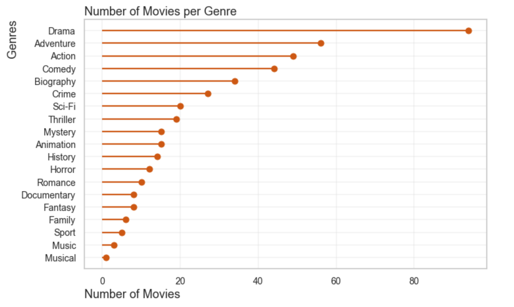
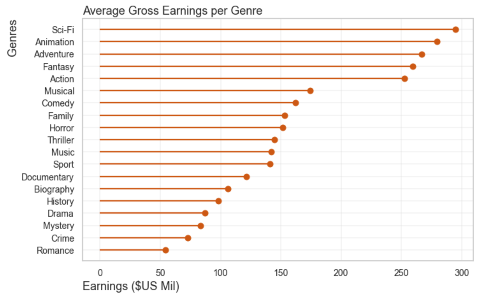
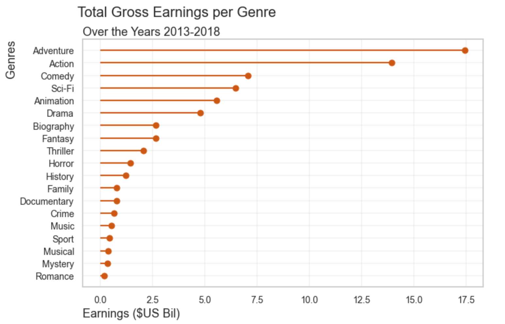

## Overview

This project analyzes current trends in the movie industry to establish a vision for Microsoft's new movie studio, Microsoft Tenné. Descriptive analysis of data from IMDb, The Movie Database, and Box Office Mojo provides insight into the genre of movies over the past five years (2013-2018) that have the highest audience ratings and highest gross earnings. Microsoft Tenné can use this analysis to guide their decision-making process in determining what genre of movie to produce.

<!--more--> 

## Business Problem

Microsoft sees many big companies creating original video content and want to establish their own movie studio to compete within the digital content market. 

To assist Microsoft in solving this problem, I will consider:

* How many movies are being made of each genre?
* What genres are the most successful, both in terms of audience rating and gross earnings?
* Of the top grossing films, which genres were most successful (had the highest gross earnings)?

Answering these questions will allow Microsoft to better decide what kind of movies to create in order to match its competitors.


## Data Understanding

The data for this analysis have come from:

* [The Movie Database](https://www.themoviedb.org/) (movie title, audience rating)
* [IMDb](https://www.imdb.com/) (movie title, release year, genres, and audience rating)
* [Box Office Mojo](https://www.boxofficemojo.com/) (movie title, gross earnings)

The target variables for this analysis are release year, gross earnings, genres, and audience ratings. These variables are all important and necessary to address Microsoft's business problem. Audience ratings, gross earnings, and release year are numeric variables (though gross earnings is continuous) and genres are categorical. 

The data used in this analysis has been compiled from three different platforms and includes all movies these platforms monitor. Since we are providing Microsoft with recommendations for success, we can safely assume these platforms accurately account for the movies of interest.

As we consider this data however, we should note that the data includes movies from 2010 to 2018. This is noteworthy because the data does not include the most recent three years of movie-making; since movie-watching trends can shift dramatically year to year, the conclusions and recommendations presented here may change based on more recent movies.


## Data Preparation

To prepare the data for analysis, I needed to combine four individual csv files into one master file. Luckily, since we're dealing with movies and movie titles, I was able to use the titles as the key for joining the dataframes.

```{python eval=FALSE}

# Import the data from The Movie Database
tmdb_movies = pd.read_csv("data/zippedData/tmdb.movies.csv.gz", index_col = 0)
# here we specify the index column otherwise we'd have a duplicated index column

# Import the data from IMDb
imdb_title_basics = pd.read_csv("data/zippedData/imdb.title.basics.csv.gz")
imdb_title_ratings = pd.read_csv("data/zippedData/imdb.title.ratings.csv.gz")

# Import the Box Office Mojo data on the gross earnings of movies
movie_gross = pd.read_csv("data/zippedData/bom.movie_gross.csv.gz")

# Join the two IMDb files into one dataframe
imdbreviews = imdb_title_basics.join(imdb_title_ratings.set_index('tconst'),
                                   how = 'inner', on = 'tconst', rsuffix = 'r')

imdbreviews = imdbreviews.drop(columns = ['original_title', 'runtime_minutes', 'numvotes'])
# Based on the documentation from IMDb, the primary title is the more popular title,
# used by the filmmakers on promotional materials whereas the original title is the original title,
# in its original language. I decided to drop the original title since we'll be more familiar with
# the primary title

imdbreviews.rename(columns = {'primary_title':'title'}, inplace = True)
# Change the column name of the movie title to 'title', which will match our additional files

```


For movies with multiple genres, I split each movie to account for each genre individually, so analysis of genre is more precise.

For the IMDb files, I did drop the 'original_title', 'runtime_minutes', and 'numvotes' columns as they are not relevant or pertinent to the business questions I am addressing.

For each of the files, I also dropped all rows that had any NaN values. I made this decision because I determined that if a movie was missing any data from these sources, that movie would not be mainstream popular nor would have gross earnings of significance and therefore could be dropped without worrying about significantly altering the analysis.

Futher, both IMDb and The Movie Database had a measure of average rating - I created a new variable that took the average of these averages, for one "master" average rating that was used in analysis. That way, the ratings from both sources are incorporated.

Lastly, I modified the gross earnings number by dividing the value by 1mil. Since the gross earnings for the movies I was analyzing are obviously more than just 1mil, I wanted the value to be more readable.

To finalize the data preparation, I created a smaller dataframe of just those movies from 2013-2018 with an average audience rating 7.0 or greater and with gross earnings greater than $27.9mil. I selected these parameters because those values represent the top 25 percent of movies based on rating and gross earnings.

```{python eval=FALSE}

# Creating a smaller dataframe of movies with at least a rating of 7.0 and grossed earnings of at least 27.9mil
moviedf_small = moviedf[(moviedf['ratingave'] >= 7) &
                        (moviedf['gross_mil'] >= 27.9) &
                        (moviedf['start_year'] > 2012)]
                        
# We want to split the genre column for analysis, so that each genre is on its own
moviedf_small = moviedf_small.assign(genres = moviedf_small['genres'].str.split(',')).explode('genres')

```


## Results

The stated business problem presented by Microsoft is establishing their own movie studio to compete within the movie market, and needing to know what kind of movies will be the most successful.

This analysis solves the stated business problem by determining what kind of movies have been the most successful - in audience rating, average gross earnings, and total gross earnings over five years - between 2013-2018. In utilizing three large datasets from industry-standard giants of IMDb, The Movie Database, and Box Office Mojo, the data is comprehensive and trustworthy.

This analysis of movies from 2013-2018 shows the following:

* There were 94 Drama movies made
* Sci-Fi, History, and Biography had the highest average rating
* Sci-Fi, Animation, Adventure, Fantasy, and Action all averaged more than 250 million dollars per movie
* Adventure and Action had the highest total gross earnings, 17.4 billion and 13.9 billion, respectively


### Number of Movies per Genre

```{python eval=FALSE}

# Create a new dataframe with the count of movies per genre
topratings_genre = (pd.DataFrame(moviedf_small.groupby('genres', as_index = False).title.nunique())).sort_values(
    by = 'title', ascending = False)
    
```



### Genres by Average Gross Earnings per Movie (US$ million)

```{python eval=FALSE}
    
# Create a new dataframe with average gross earnings per genre
topratings_gross = moviedf_small[['title', 'genres', 'gross_mil']]
topratings_gross = topratings_gross.groupby('genres', as_index = False).mean()
topratings_gross.sort_values('gross_mil', ascending = False, inplace = True)

```



### Total Gross Earnings by Genre

```{python eval=FALSE}

# Create a dataframe with title, genre, and gross earnings from 2013-2018
gross_sum = moviedf_small[['genres', 'gross_mil', 'start_year']]
gross_sum = gross_sum[(gross_sum['gross_mil'] > 139.7) &
                      (gross_sum['start_year'] > 2012)]

```




## Conclusions

This analysis leads to three recommendations of what movies to produce for Microsoft's new movie studo, Tenné.

* **For successful, sustained gross earnings over time, Tenné should produce Adventure and Action.** These two genres have demonstrated consistent success over five years in amassing the most amount of gross earnings.
<br>

* **For immediately successful gross earnings, Tenné should produce movies that are Sci-Fi, Animation, Adventure, Fantasy, or Action**. These five genres all average at least 250 million dollars per film.
<br>

* **Create Sci-Fi movies**. Between 2013 and 2018, 218 movies were produced, and only **20** of those movies were Sci-Fi. Knowing that Sci-Fi movies do well in average gross earnings per movie **and** that the market is not overly saturated with Sci-Fi movies, this genre would be the most likely an immediate impact on the success of Microsoft Tenné.


## Next Steps

Further analyses could yield additional insights to further improve Microsoft Tenné's decision-making protocol in determining what genre of movie to create.

* **Analyze more recent data from 2019-2021.** One, this would provide more current data, and two, this would incorporate the changes in viewing practices as a result of the Covid-19 pandemic. Throughout the pandemic, more people watched movies from home and movie studios did direct-to-stream releases. Pulling data from streaming services on number of streams will be highly informative in terms of what people have been watching.
* **Analyze streaming data.** As mentioned above, using data to compare ratings and earnings of traditional theatre-released movies vs. ratings and number of streams of released-to-streaming platforms will be critical as Microsoft enters the field. Are traditional theatre-released movies the most successful?
* **Analyze demographics of movie-makers and movie-watchers.** Could Microsoft become a leader in creating films by and for marginalized and underrepresented populations within the film industry - women, people of color, women of color, LGBTQIA people, multilingual films? Given the success of Black Panther, Parasite, and Roma (as just a few examples), is there a case to be made for Microsoft becoming the home for diverse movies?


Attribution: [The Flatiron School repo](https://github.com/learn-co-curriculum/dsc-phase-1-project-v2-4)
