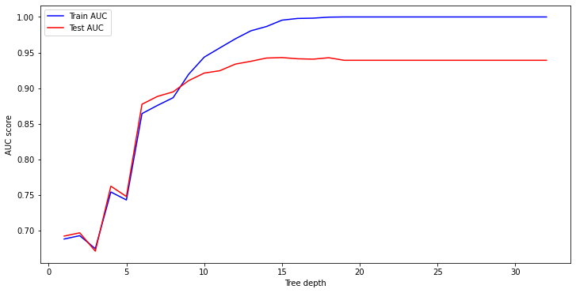
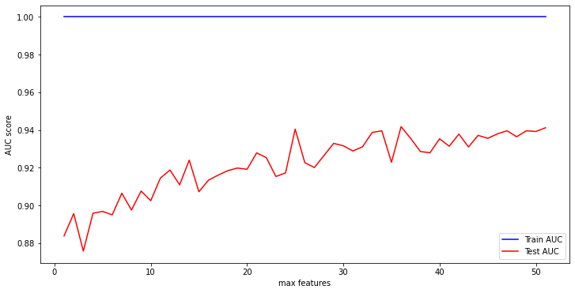

# Nonparametric ML Models - Cumulative Lab

## Introduction

This demonstrates my applications of two nonparametric models — k-nearest neighbors and decision trees — to the forest cover dataset.

> Here I will be using an adapted version of the forest cover dataset from the [UCI Machine Learning Repository](https://archive.ics.uci.edu/ml/datasets/covertype). Each record represents a 30 x 30 meter cell of land within Roosevelt National Forest in northern Colorado, which has been labeled as `Cover_Type` 1 for "Cottonwood/Willow" and `Cover_Type` 0 for "Ponderosa Pine". (The original dataset contained 7 cover types but this has been simplified.)

The task is to predict the `Cover_Type` based on the available cartographic variables:

> There are over 38,000 rows, each with 52 feature columns and 1 target column:

> * `Elevation`: Elevation in meters
> * `Aspect`: Aspect in degrees azimuth
> * `Slope`: Slope in degrees
> * `Horizontal_Distance_To_Hydrology`: Horizontal dist to nearest surface water features in meters
> * `Vertical_Distance_To_Hydrology`: Vertical dist to nearest surface water features in meters
> * `Horizontal_Distance_To_Roadways`: Horizontal dist to nearest roadway in meters
> * `Hillshade_9am`: Hillshade index at 9am, summer solstice
> * `Hillshade_Noon`: Hillshade index at noon, summer solstice
> * `Hillshade_3pm`: Hillshade index at 3pm, summer solstice
> * `Horizontal_Distance_To_Fire_Points`: Horizontal dist to nearest wildfire ignition points, meters
> * `Wilderness_Area_x`: Wilderness area designation (3 columns)
> * `Soil_Type_x`: Soil Type designation (39 columns)
> * `Cover_Type`: 1 for cottonwood/willow, 0 for ponderosa pine

This is also an imbalanced dataset, since cottonwood/willow trees are relatively rare in this forest:


## 1. Set Up Modeling

```{python, eval=FALSE}
# Import train_test_split 
from sklearn.model_selection import train_test_split

# Split the data
X = df.drop("Cover_Type", axis=1)
y = df["Cover_Type"]

X_train, X_test, y_train, y_test = train_test_split(X, y, random_state = 42, stratify = y)
```


```{python, eval=FALSE}
# Import StandardScaler
from sklearn.preprocessing import StandardScaler

# Instantiate StandardScaler
scaler = scaler = StandardScaler()

# Transform the training and test sets
X_train_scaled = scaler.fit_transform(X_train)
X_test_scaled = scaler.transform(X_test)

```


## 2. Build a Baseline kNN Model

Build a scikit-learn kNN model with default hyperparameters. Then use `cross_val_score` with `scoring="neg_log_loss"` to find the mean log loss for this model (passing in `X_train_scaled` and `y_train` to `cross_val_score`). Find the mean of the cross-validated scores, and negate the value (either put a `-` at the beginning or multiply by `-1`) so that the answer is a log loss rather than a negative log loss.


```{python, eval=FALSE}
from sklearn.neighbors import KNeighborsClassifier
from sklearn.model_selection import cross_val_score

knn_baseline_model = KNeighborsClassifier()

knn_baseline_log_loss = -cross_val_score(knn_baseline_model, X_train_scaled, y_train, scoring="neg_log_loss").mean()
knn_baseline_log_loss
```

    0.1255288892455634

The best logistic regression model completed previously had a log loss of 0.13, so log loss of this vanilla kNN model is better; however, it was also much slower, taking around a minute to complete the cross-validation on this machine.

## 3. Build Iterative Models to Find the Best kNN Model

```{python, eval=FALSE}
knn_model2 = KNeighborsClassifier(n_neighbors = 25)

knn_model2_log_loss = -cross_val_score(knn_model2, X_train_scaled, y_train, scoring="neg_log_loss").mean()
knn_model2_log_loss
```

    0.06425722742416393

```{python, eval=FALSE}
knn_model3 = KNeighborsClassifier(n_neighbors = 50)

knn_model3_log_loss = -cross_val_score(knn_model3, X_train_scaled, y_train, scoring="neg_log_loss").mean()
knn_model3_log_loss
```

    0.078613760394212

```{python, eval=FALSE}
knn_model4 = KNeighborsClassifier(n_neighbors = 50, metric = 'manhattan')

knn_model4_log_loss = -cross_val_score(knn_model4, X_train_scaled, y_train, scoring="neg_log_loss").mean()
knn_model4_log_loss
```

    0.07621145166565102

```{python, eval=FALSE}
knn_model5 = KNeighborsClassifier(n_neighbors = 25, metric = 'manhattan')

knn_model5_log_loss = -cross_val_score(knn_model5, X_train_scaled, y_train, scoring="neg_log_loss").mean()
knn_model5_log_loss
```

    0.06519186918054885


This fifth model has the smallest log loss value and thus is our best performing kNN model.

## 4. Build a Baseline Decision Tree Model

Now, start investigating decision tree models.

```{python, eval=FALSE}
from sklearn.tree import DecisionTreeClassifier

dtree_baseline_model = DecisionTreeClassifier(random_state=42)

dtree_baseline_log_loss = -cross_val_score(dtree_baseline_model, X_train, y_train, scoring="neg_log_loss").mean()
dtree_baseline_log_loss
```

    0.7045390124149022

This is much worse than either the logistic regression (0.1303) or the best of kNN model iterations (0.0643). We can probably assume that the model is badly overfitting, since we have not "pruned" it at all.

## 5. Build Iterative Models to Find the Best Decision Tree Model

Build and evaluate two more decision tree models to find the best one.

```{python, eval=FALSE}
dtree_model2 = DecisionTreeClassifier(random_state=42, criterion='entropy')

dtree_model2_log_loss = -cross_val_score(dtree_model2, X_train, y_train, scoring="neg_log_loss").mean()
dtree_model2_log_loss
```

    0.6543002106787194

```{python, eval=FALSE}
from sklearn.metrics import roc_curve, auc
import numpy as np
import matplotlib.pyplot as plt

# Identify the optimal tree depth for given data
max_depths = np.linspace(1, 32, 32, endpoint=True)
train_results = []
test_results = []
for max_depth in max_depths:
   dt = DecisionTreeClassifier(criterion='entropy', max_depth=max_depth, random_state=10)
   dt.fit(X_train, y_train)
   train_pred = dt.predict(X_train)
   false_positive_rate, true_positive_rate, thresholds = roc_curve(y_train, train_pred)
   roc_auc = auc(false_positive_rate, true_positive_rate)
   # Add auc score to previous train results
   train_results.append(roc_auc)
   y_pred = dt.predict(X_test)
   false_positive_rate, true_positive_rate, thresholds = roc_curve(y_test, y_pred)
   roc_auc = auc(false_positive_rate, true_positive_rate)
   # Add auc score to previous test results
   test_results.append(roc_auc)

plt.figure(figsize=(12,6))
plt.plot(max_depths, train_results, 'b', label='Train AUC')
plt.plot(max_depths, test_results, 'r', label='Test AUC')
plt.ylabel('AUC score')
plt.xlabel('Tree depth')
plt.legend()
plt.show()
```


    

```{python, eval=FALSE}
dtree_model3 = DecisionTreeClassifier(random_state=42,
                                      criterion='entropy',
                                      max_depth = 8)

dtree_model3_log_loss = -cross_val_score(dtree_model3, X_train, y_train, scoring="neg_log_loss").mean()
dtree_model3_log_loss
```

    0.1775668139810499

```{python, eval=FALSE}
dtree_model4 = DecisionTreeClassifier(random_state=42,
                                      criterion='entropy',
                                      max_depth = 8,
                                      min_samples_leaf = 10)

dtree_model4_log_loss = -cross_val_score(dtree_model4, X_train, y_train, scoring="neg_log_loss").mean()
dtree_model4_log_loss
```

    0.1407497348442239

```{python, eval=FALSE}
dtree_model5 = DecisionTreeClassifier(random_state=42,
                                      criterion='entropy',
                                      max_depth = 8,
                                      min_samples_leaf = 100)

dtree_model5_log_loss = -cross_val_score(dtree_model5, X_train, y_train, scoring="neg_log_loss").mean()
dtree_model5_log_loss
```

    0.10910816433690831

```{python, eval=FALSE}
# Find the best value for optimal maximum feature size
max_features = list(range(1, X_train.shape[1]))
train_results = []
test_results = []
for max_feature in max_features:
   dt = DecisionTreeClassifier(criterion='entropy', max_features=max_feature, random_state=10)
   dt.fit(X_train, y_train)
   train_pred = dt.predict(X_train)
   false_positive_rate, true_positive_rate, thresholds = roc_curve(y_train, train_pred)
   roc_auc = auc(false_positive_rate, true_positive_rate)
   train_results.append(roc_auc)
   y_pred = dt.predict(X_test)
   false_positive_rate, true_positive_rate, thresholds = roc_curve(y_test, y_pred)
   roc_auc = auc(false_positive_rate, true_positive_rate)
   test_results.append(roc_auc)

plt.figure(figsize=(12,6))
plt.plot(max_features, train_results, 'b', label='Train AUC')
plt.plot(max_features, test_results, 'r', label='Test AUC')
plt.ylabel('AUC score')
plt.xlabel('max features')
plt.legend()
plt.show()
```




```{python, eval=FALSE}
dtree_model6 = DecisionTreeClassifier(random_state=42,
                                      criterion='entropy',
                                      max_depth = 8,
                                      min_samples_leaf = 100,
                                      max_features = 25)

dtree_model6_log_loss = -cross_val_score(dtree_model6, X_train, y_train, scoring="neg_log_loss").mean()
dtree_model6_log_loss
```

    0.10486292521511258

## 6. Choose and Evaluate an Overall Best Model

The kNN model with n_neighbors of 25 was the best performing model. Instantiate a variable `final_model` using your best model with the best hyperparameters.


```{python, eval=FALSE}
# Replace None with appropriate code
final_model = KNeighborsClassifier(n_neighbors = 25)

# Fit the model on the full training data
# (scaled or unscaled depending on the model)
final_model.fit(X_train_scaled, y_train)
```

Evaluate the log loss, accuracy, precision, and recall. 

```{python, eval=FALSE}
from sklearn.metrics import accuracy_score, precision_score, recall_score, log_loss

preds = final_model.predict(X_test_scaled)
probs = final_model.predict_proba(X_test_scaled)

print("log loss: ", log_loss(y_test, probs))
print("accuracy: ", accuracy_score(y_test, preds))
print("precision:", precision_score(y_test, preds))
print("recall:   ", recall_score(y_test, preds))
```

    log loss:  0.08075852922963977
    accuracy:  0.9754830666943695
    precision: 0.9033989266547406
    recall:    0.735080058224163


This model has **97.5% accuracy**, meaning that it assigns the correct label 97.5% of the time. This is definitely an improvement over a "dummy" model, which would have about 92% accuracy.

If the model labels a given forest area a 1, there is about a 90% chance that it really is class 1, compared to about a 67% chance with the logistic regression (**precision**).

The recall score is also improved from the logistic regression model. If a given cell of forest really is class 1, there is about a 73.5% chance that our model will label it correctly (**recall**). This is better than the 48% of the logistic regression model, but still doesn't instill a lot of confidence. If the business really cared about avoiding "false negatives" (labeling cottonwood/willow as ponderosa pine) more so than avoiding "false positives" (labeling ponderosa pine as cottonwood/willow), then we might want to adjust the decision threshold on this.

## Conclusion

In this lab, I demonstrated the end-to-end machine learning process with multiple model algorithms, including tuning the hyperparameters for those different algorithms. Nonparametric models can be more flexible than linear models, potentially leading to overfitting but also potentially reducing underfitting by being able to learn non-linear relationships between variables, but there can be a tradeoff between speed and performance, with good metrics correlating with slow speeds.
