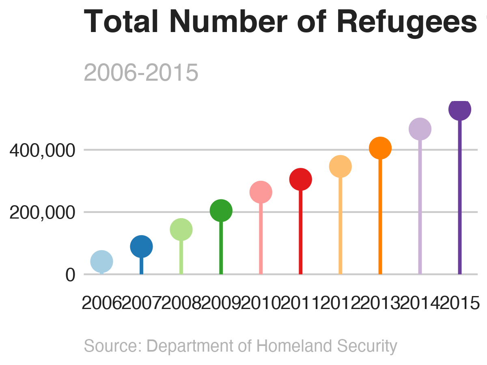

This project highlights the code and outputs of a project visualizing the number of refugees to the US that was completed as an assignment for Dr. Andrew Heiss' [Data Visualization course](https://datavizs21.classes.andrewheiss.com/assignment/02-mini-project/).

<!--more-->


```{r clean-raw-data, eval=FALSE}

# Create vector of non-countries to filter out
non_countries <- c("Africa", "Asia", "Europe", "North America", "Oceania", 
                   "South America", "Unknown", "Other", "Total")

refugees_clean <- refugees_raw %>%
  rename(origin_country = `Continent/Country of Nationality`) %>%
  filter(!(origin_country %in% non_countries)) %>%
  mutate(iso3 = countrycode(origin_country, "country.name", "iso3c",
                            custom_match = c("Korea, North" = "PRK"))) %>%
  mutate(origin_country = countrycode(iso3, "iso3c", "country.name"),
         origin_region = countrycode(iso3, "iso3c", "region"),
         origin_continent = countrycode(iso3, "iso3c", "continent")) %>%
  gather(year, number, -origin_country, -iso3, -origin_region,
         -origin_continent) %>%
  mutate(year = as.numeric(year),
         year_date = ymd(paste0(year, "-01-01")))

# Dataframe with total sum of refugees by country per year
refugees_countries_cumulative <- refugees_clean %>%
  arrange(year_date) %>%
  group_by(origin_country) %>%
  mutate(cumulative_total = cumsum(number))


```

<br>


## Clean the data
<br>

I pivoted wider to be able to calculate the rankings of each country within the 2006-2015 time period. I then sorted each year to determine the top five ranking score so that I could note the top 5 countries of origin of refugees for each year. I then returned to our tidy dataframe and created a new dataframe with all those countries that ranked in the top 5 over the 2006-2015 time period. And lastly, I saved this newly created dataframe.

<br>
```{r clean-data, eval=FALSE}

top_refugees_all <- refugees_countries_cumulative %>%
  filter(year %in% c(2006:2015)) %>% 
  drop_na(cumulative_total) %>% 
  group_by(year) %>% 
  mutate(ranking = rank(cumulative_total)) %>% 
  ungroup() %>% 
  pivot_wider(names_from = year, names_prefix = "rank_", values_from = ranking)

top_refugee_countries <- top_refugees_all %>%
  select(origin_country, year_date, cumulative_total, rank_2006, rank_2007,
         rank_2008,rank_2009, rank_2010, rank_2011, rank_2012, rank_2013,
         rank_2014, rank_2015) %>%
  filter(rank_2006 >= 49.0 |
         rank_2007 >= 42.0 |
         rank_2008 >= 38.0 |
         rank_2009 >= 37.0 |
         rank_2010 >= 35 |
         rank_2011 >= 35.0 |
         rank_2012 >= 32 |
         rank_2013 >= 30 |
         rank_2014 >=30 |
         rank_2015 >= 28.0)

alltime_refugee <- refugees_countries_cumulative %>%
  filter(origin_country %in% c("Cuba","Iran","Russia","Somalia","Vietnam",
                               "Myanmar (Burma)","Iraq"))

write.csv(alltime_refugee, "alltime_refugees.csv")

```

<br>


## Import the refined data
<br>

Offline, I added the number of refugees granted asylum each year as both a number and proportion to total number of refugees as well as the GDP per capita for each country each year. The number of refugees granted asylym came from the [2015 Yearbook of Immigration Statistics](https://www.dhs.gov/sites/default/files/publications/Yearbook_Immigration_Statistics_2015.pdf) from the Department of Homeland Security. The GDP per capita numbers came from the [World Bank's DataBank](https://databank.worldbank.org/home).

I then imported that dataframe to work with for the visualizations.

<br>

# **The Story**


## Visualizations of refugee data

```{r total-refugees-plots, eval=FALSE}

total <- refugees_countries_cumulative %>%
  group_by(year_date) %>%
  summarise(total = sum(cumulative_total, na.rm = TRUE))

mypalette <- brewer.pal(10,"Paired")

# Total number of refugees over time
total_plot <- ggplot(total,
                     aes(x = year_date, y = total)) +
  geom_pointrange(aes(ymin = 0, ymax = total),
                  fatten = 5, size = 1, col = mypalette) +
  scale_y_continuous(labels = comma) +
  scale_x_date(date_breaks = "1 year", date_labels = "%Y") +
  labs(x = NULL, y = NULL,
       title = "Total Number of Refugees to the U.S.",
       subtitle = "2006-2015",
       caption = "Source: Department of Homeland Security") +
  bbc_style() +
  theme(panel.grid.minor = element_blank(),
        plot.title = element_text(face = "bold", size = rel(1.7)),
        plot.subtitle = element_text(face = "plain", size = rel(1.3),
                                     color = "grey70"),
        plot.caption = element_text(face = "italic", size = rel(0.9), 
                                    color = "grey70", hjust = 0),
        axis.text = element_text(size = rel(1)),
        legend.position = "none")


```




```{r total-over-time, eval=FALSE}


complete_refugees$origin_country <- factor(
  complete_refugees$origin_country, levels = c(
    "Myanmar (Burma)","Iraq","Somalia","Iran","Cuba","Russia","Vietnam"))


total_over_time_plot <- ggplot(complete_refugees,
                               mapping = aes(year, cumulative_total,
                                             color = origin_country)) + 
  geom_line(size = 1.1, alpha = .7) +
  scale_color_brewer(palette = "Paired") +
  scale_x_continuous(breaks = 2006:2015, minor_breaks = 2006:2015) +
  scale_y_continuous(labels = comma) +
  labs(x = NULL, y = NULL) +
  bbc_style() +
  theme(panel.grid.minor = element_blank(),
        axis.text = element_text(size = rel(.5)),
        legend.position = "none")


```


```{r bump-chart-with-flags, eval=FALSE}

rankings_plot <- ggplot(alltime_rank,
                        aes(x = year, y = rank, color = origin_country)) +
  geom_line(alpha = .6, size = 1.5) +
  geom_point(size = 1) +
  geom_point(alpha = .6, size = 3) +
  geom_point(size = 1) +
  scale_color_brewer(palette = "Paired") +
  scale_y_reverse(breaks = 1:7) +
  scale_x_continuous(breaks = 2006:2016, minor_breaks = 2006:2016) +
  geom_flag(data = country_flags_start,
            aes(x = x, y = y, country = country, size = 1),inherit.aes = FALSE) +
  geom_flag(data = country_flags_end,
            aes(x = x, y = y, country = country, size = 1),inherit.aes = FALSE) +
  theme(legend.position = "none") +
  labs(x = NULL,
       y = NULL) +
  bbc_style() +
  theme(panel.grid.minor = element_blank(),
        axis.text = element_text(size = rel(.5)),
        legend.position = "none")

```


<br>

## The Final Product


