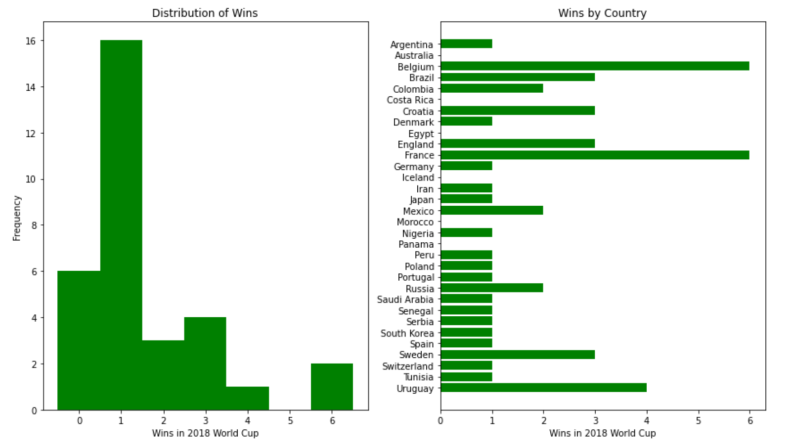
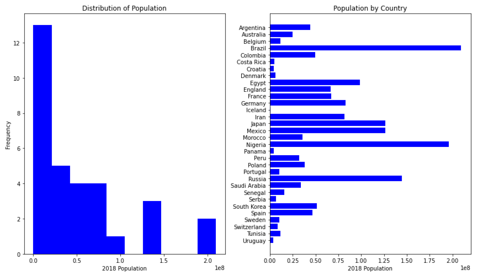
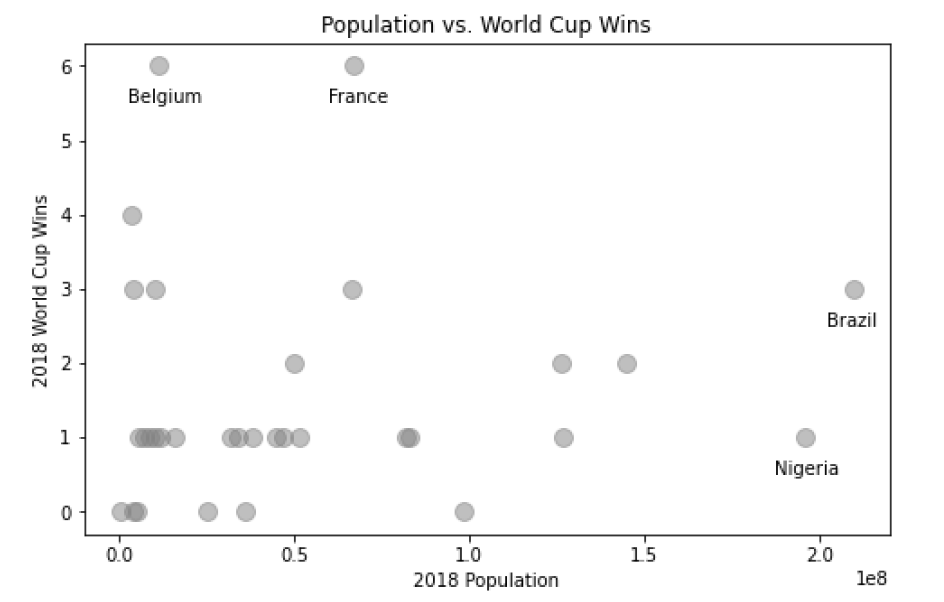

```{r include=FALSE, warning=FALSE}
library(reticulate)
library(jsonlite)
use_condaenv("learn-env")
```


Using data from the 2018 Men's World Cup, we are going to ascertain if any relationship exists between participating countries' population and success (as measured by cumulative wins).

<!--more-->

## Introduction to Data Analysis - Cumulative Lab
The objectives of this lab are to:

- Practice reading serialized JSON and CSV data from files into Python objects
- Practice extracting information from nested data structures
- Practice cleaning data (filtering, normalizing locations, converting types)
- Combine data from multiple sources into a single data structure
- Interpret descriptive statistics and data visualizations to present my findings

### The Task: To Analyze the Relationship between Population and Men's World Cup Success
Using data from the 2018 Men's World Cup, we are going to ascertain if any relationship exists between participating countries' population and success (as measured by cumulative wins).

### Data Understanding

The data sources for this analysis will be pulled from two separate files.

`world_cup_2018.json`

- Source: This dataset comes from [football.db](http://openfootball.github.io/), a "free and open public domain football database & schema for use in any (programming) language"
- Contents: Data about all games in the 2018 World Cup, including date, location (city and stadium), teams, goals scored (and by whom), and tournament group
- Format: Nested JSON data (dictionary containing a list of rounds, each of which contains a list of matches, each of which contains information about the teams involved and the points scored)


`country_populations.csv`

- Source: This dataset comes from a curated collection by [DataHub.io](https://datahub.io/core/population), originally sourced from the World Bank
- Contents: Data about populations by country for all available years from 1960 to 2018
- Format: CSV data, where each row contains a country name, a year, and a population

#### Getting the Data
```{python, eval=FALSE}

# Import necessary packages
import json # Loads the json package, which allows us to read a .json file
import csv # Loads the csv package, which allows us to read a csv file

```

Open the relevant files
```{python, eval=FALSE}

world_cup_file = open("data/world_cup_2018.json", encoding='utf8')
population_file = open("data/country_populations.csv")

```

Here, we use the `json` package to load the data from the `world_cup_file` into a dictionary (which we'll use for analysis) called `world_cup_data` and we'll use the `csv` package to to load the data from `population_file` into a list of dictionaries called `population_data`

```{python, eval=FALSE}

# Men's World Cup Data
world_cup_data = json.load(world_cup_file)
# Here's we're loading the data, and saving the data into an object, world_cup_data


# Close the file now that we're done reading from it
world_cup_file.close()

# Population Data
population_data = list(csv.DictReader(population_file))
# Same as with the world_cup_data

# Close the file now that we're done reading from it
population_file.close()

```

### Working on the Men's World Cup Data

What is the structure of the `world_cup_data`?
```{python, eval=FALSE}

# This line of code will return the keys of the dictionary, which allows us to see
# how the data is structured
world_cup_data.keys()

```

This indicates the World Cup data is a dictionary, with two keys, 'name' and 'rounds'

**Extracting the Rounds**
<br>
First, we want to extract the rounds of the World Cup matches, so we can determine the number of wins from those matches.

```{python, eval=FALSE}

# Create a variable called "rounds" from the "rounds" key.
rounds = world_cup_data["rounds"]

# This prints the type of data of "rounds" (a list), the length of the "rounds" variable (20 rounds), and prints the three ...
print("type(rounds):", type(rounds))
print("len(rounds):", len(rounds))
print("rounds[3]:")

# This line just prints the 4th entry, so we can we that everything worked
rounds[3]

```

The `rounds` variable we have created is a list of dictionaries, with each dictionary of inside of `rounds` containing a name (such as 'Matchday 4') as well as the list of matches that occurred on that day (along with match details)

**Extracting the Matches**
<br>

```{python, eval=FALSE}

# Create a variable, "matches," that is an empty list
matches = []

# This is a looping function
for round_ in rounds:
    # Extract the list of matches for this round
    round_matches = round_["matches"]
    # Add them to the overall list of matches, which is the variable we created at the beginning
    matches.extend(round_matches)
    
# View the first entry
matches[0]

```


**Extracting the Teams**
<br>

We know that each match has two teams, `team1` and `team2`, so we're going to create a list of all unique team names by looping over every match in `matches` and adding the "name" values associated with both `team1` and `team2`

```{python, eval=FALSE}

# Create a variable, "teams_set", that is an empty set
teams_set = set()

for match in matches:
    # Add team1 value to teams_set
    teams_set.add(match["team1"]["name"])
    # Add team2 value to teams_set
    teams_set.add(match["team2"]["name"])
    
# Create a "teams" variable that is a sorted list based on the teams_set
teams = sorted(list(teams_set))

# View the list
print(teams)

```


Now that we have our `teams` variable that is comprised of all the participating teams at the 2018 Men's World Cup, we move on to connecting each team name with its performance at the World Cup, as measured by the count of total wins.

<br>

### Men's World Cup Performance
In this section, we start by initializing a dictionary called `combined_data` containing:

- Keys: the strings from teams
- Values: each value the same, a dictionary containing the key 'wins' with the associated value 0.

```{python, eval=FALSE}

# This uses dictionary comprehension, creating a dictionary (noted by {}) with the team as the key and the value set to number of wins - for each team in the teams list
combined_data = {team: {"wins": 0} for team in teams}

```

To add wins to the dictionary, we're going to write a function that we can call on the `match` dictionary.

```{python, eval=FALSE}

# This first chunk is defining the function, find_winner()
def find_winner(match):
    """
    Given a dictionary containing information about a match,
    return the name of the winner (or None in the case of a tie)
    """
    score_1 = match["score1"]
    score_2 = match["score2"]
    
    if score_1 > score_2:
        return match["team1"]["name"]
    elif score_2 > score_1:
        return match["team2"]["name"]
    else:
        return None
    # ^ this else: return None is not actually necessary since Python returns
    # None if nothing is returned

```

Once this function is defined, we can loop over every match in `matches` to find the winner and add +1 to associated count in `combined_data`

```{python, eval=FALSE}

for match in matches:
    # Get the name of the winner
    winner = find_winner(match) # the function we wrote above
    # Only proceed to the next step if there was a winner
    if winner:
        # Add 1 to the associated count of wins
        combined_data[winner]["wins"] += 1
        
# Visually inspect the output to ensure the wins are different for different countries
combined_data

```

### Analysis of Wins

While we could try to understand all 32 of those numbers just by scanning through them, let's use some descriptive statistics and data visualizations instead!

**Statistical Summary of Wins**
<br>
The code below calculates the mean, median, and standard deviation of the number of wins. If it doesn't work, that is an indication that something went wrong with the creation of the `combined_data` variable, and you might want to look at the solution branch and fix your code before proceeding.

```{python, eval=FALSE}

import numpy as np
# numpy is a python package that allows us to do statistical analysis

wins = [val["wins"] for val in combined_data.values()]

print("Mean number of wins:", np.mean(wins))
print("Median number of wins:", np.median(wins))
print("Standard deviation of number of wins:", np.std(wins))

```

**Visualization**

```{python, eval=FALSE}

import matplotlib.pyplot as plt
# matplotlib is a python package that allows us to create visualizations

# Set up figure and axes
fig, (ax1, ax2) = plt.subplots(ncols=2, figsize=(12, 7))
fig.set_tight_layout(True)

# Histogram of Wins and Frequencies
ax1.hist(x=wins, bins=range(8), align="left", color="green")
ax1.set_xticks(range(7))
ax1.set_xlabel("Wins in 2018 World Cup")
ax1.set_ylabel("Frequency")
ax1.set_title("Distribution of Wins")

# Horizontal Bar Graph of Wins by Country
ax2.barh(teams[::-1], wins[::-1], color="green")
ax2.set_xlabel("Wins in 2018 World Cup")
ax2.set_title("Wins by Country");

```



### Working on the World Population Data
We need to filter the `population_data` dataset to include only those populations from 2018 and only those countries listed in the `teams` dataset we completed above.

First, we need to normalize the country names to ensure country names match.

```{python, eval=FALSE}

def normalize_location(country_name):
    """
    Given a country name, return the name that the
    country uses when playing in the FIFA World Cup
    """
    name_sub_dict = {
        "Russian Federation": "Russia",
        "Egypt, Arab Rep.": "Egypt",
        "Iran, Islamic Rep.": "Iran",
        "Korea, Rep.": "South Korea",
        "United Kingdom": "England"
    }
    # The .get method returns the corresponding value from
    # the dict if present, otherwise returns country_name
    return name_sub_dict.get(country_name, country_name)
    
```

Then we can create our filtered population dataset.

```{python, eval=FALSE}

population_data_filtered = []

for record in population_data:
    # Get normalized country name
    normalized_name = normalize_location(record["Country Name"])
    # Add record to population_data_filtered if relevant
    if (normalized_name in teams) and (record["Year"] == "2018"):
        # Replace the country name in the record
        record["Country Name"] = normalized_name
        # Append to list
        population_data_filtered.append(record)

```

Unfortunately, the population values from the `population_data` file are entered as objects/characters, not integers, so we need to change the values' datatype.

```{python, eval=FALSE}

for record in population_data_filtered:
    # Convert the population value from str to int
    record["Value"] = int(record["Value"])
    
```

Now, we can loop over `population_data_filtered` and add information about population to each country in `combined_data`!

```{python, eval=FALSE}

for record in population_data_filtered:
    # Extract the country name from the record
    country = record["Country Name"]
    # Extract the population value from the record
    population = record["Value"]
    # Add this information to combined_data
    combined_data[country]["population"] = population
    
```

**Statistical Analysis of Population**
```{python, eval=FALSE}

populations = [val["population"] for val in combined_data.values()]

print("Mean population:", np.mean(populations))
print("Median population:", np.median(populations))
print("Standard deviation of population:", np.std(populations))

```

Mean population: 51687460.84
Median population: 34864542.5
Standard deviation of population: 55195121.61


**Visualizations of Population**
```{python, eval=FALSE}

# Set up figure and axes
fig, (ax1, ax2) = plt.subplots(ncols=2, figsize=(12, 7))
fig.set_tight_layout(True)

# Histogram of Populations and Frequencies
ax1.hist(x=populations, color="blue")
ax1.set_xlabel("2018 Population")
ax1.set_ylabel("Frequency")
ax1.set_title("Distribution of Population")

# Horizontal Bar Graph of Population by Country
ax2.barh(teams[::-1], populations[::-1], color="blue")
ax2.set_xlabel("2018 Population")
ax2.set_title("Population by Country");

```



### Analysis of Performance vs. Population
**Statistical Measure - Correlation**
```{python, eval=FALSE}

np.corrcoef(wins, populations)[0][1]

```

Correlation coefficient: 0.0759

This returns a correlation  a very weak positive correlation between population and performance.

**Data Visualization of Correlation**
```{python, eval=FALSE}

# Set up figure
fig, ax = plt.subplots(figsize=(8, 5))

# Basic scatter plot
ax.scatter(
    x=populations,
    y=wins,
    color="gray", alpha=0.5, s=100
)
ax.set_xlabel("2018 Population")
ax.set_ylabel("2018 World Cup Wins")
ax.set_title("Population vs. World Cup Wins")

# Add annotations for specific points of interest
highlighted_points = {
    "Belgium": 2, # Numbers are the index of that
    "Brazil": 3,  # country in populations & wins
    "France": 10,
    "Nigeria": 17
}
for country, index in highlighted_points.items():
    # Get x and y position of data point
    x = populations[index]
    y = wins[index]
    # Move each point slightly down and to the left
    # (numbers were chosen by manually tweaking)
    xtext = x - (1.25e6 * len(country))
    ytext = y - 0.5
    # Annotate with relevant arguments
    ax.annotate(
        text=country,
        xy=(x, y),
        xytext=(xtext, ytext)
    )

```



## Final Analysis
**What is the relationship between the population of a country and their performance in the 2018 FIFA World Cup?**

Logic would dictate that the greater a country's population, the more likely they are to have a better soccer team because they have a larger player pool than countries with smaller populations. The more people, the more possible players.

However, sheer numbers of people doesn't equate to succes in sports - in this case, the men's World Cup. Yes, Brazil makes a good case, but what about China, India, or the United States? And why would such a small country like Belgium be so good at soccer if its population is comparatively so much smaller?

I'd want to evaluate available government funding of soccer in these countries. How much state support do the national soccer federations receive? Is there a correlation with country wealth as well? Maybe measured by GDP per capita or income per capita.


